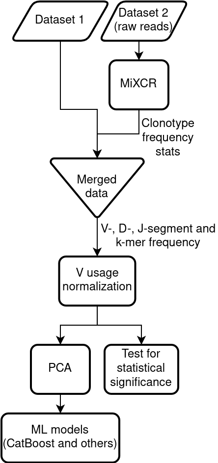

# Sample classification

## Objectives
1. Identify a set of TCRs from high-throughput sequencing data (Shoukat et al.) that are associated with COVID-19 using MiXCR.
2. Identify and correct systematic error difference between Shoukat et al. and Shomuradova et al. repertoire sequencing datasets.
3. Develop classifier(s) that can tell COVID-19 status based on donor TCR repertoire.
4. Explore k-mer markers that allow to predict COVID-19 status - their location and possible origin.

## Methods

We used MiXCR to get annnotation and calculate clonotype frequency statistics from raw sequences data. Then V-usage normalization was applied to the generated feature tables and k-mer and VDJ-genes frequencied were calculated for each sample. The frequencies were used as input features for several machine learning models (namely, CatBoost ensemble and hierarchical clustering). We also performed statistical tests for each k-mer frequency and inspected location of the most significant ones. Python graphing libraries (matplotlib, seaborn and Logomaker) were used to visualize our findings.

## Results

V-usage normzliation noticeably reduces bias between datasets, as can be seen from PCA plots and hierarchical clustering results (unnormalized samples are on the left):

  
   

  
   

We observed poor CatBoost performance when the train and test samples originated from different datasets:

After applying statistical tests, we observed that top significant k-mers (i.e., with the lowest p-value) are located towards the end of CDR3 sequence (left). They also allow for unambiguous decision boundry between Healthy and Convalescent groups (right).

  
   

## Data availability
Apart from the [dataset](https://www.ebi.ac.uk/ena/browser/view/PRJEB38339) from _Shoukat et al._ article, this project used some yet unpublished samples that are not to be shared at the moment. Generated frequency tables, however, are free for use (files `freq_table.csv` and `freq_table_normalized.csv`).

## System requirements 

The work was performed using HP Pavilion Notebook with the following parameters:
* OS - Ubuntu 20.04.1 LTS x86_64 
* CPU - Intel i5-8300H (8) @ 4.000GHz
* RAM - 7809MiB

The following software was used during the course of the project:
* MiXCR v3.0.13
* Python 3.8.5
* Jupyter notebook 6.1.4

Third-party python libraries:
* numpy 1.19.2
* pandas 1.1.3
* scipy 1.5.2
* seaborn 0.11.1
* matplotlib 3.4.1
* scikitplot 0.3.7
* logomaker 0.8 
* catboost 0.24.4

## References 

Old samples:

- immunity_paper_data - samples from Somuradova et al
-- PBMC - whole blood from COVID+ donors
-- IFNg CD4 - CD4 T-cells that respond to stimulation by coronavirus epitopes
-- IFNg CD8 - CD4 T-cells that respond to stimulation by coronavirus epitopes

New samples (unpublished, should not be shared!):

- convalescent - new data on COVID+ donors (PBMC)
- healthy - healthy donors obtained with the same protocol (PBMC)
- icu - acute COVID+, on intralung ventilation devises (PBMC)
- icu_lung - same as ICU, but T-cells are taken from lung tissue

The idea is to train a classifier that would tell convalescent from healthy, one can use IFNg+ clonotypes (observed in IFNg more than in PBMC) from all data as features for classifier. Other ideas welcome

Can also add data from [Shoukat et al.](https://www.sciencedirect.com/science/article/pii/S2666379121000033)
